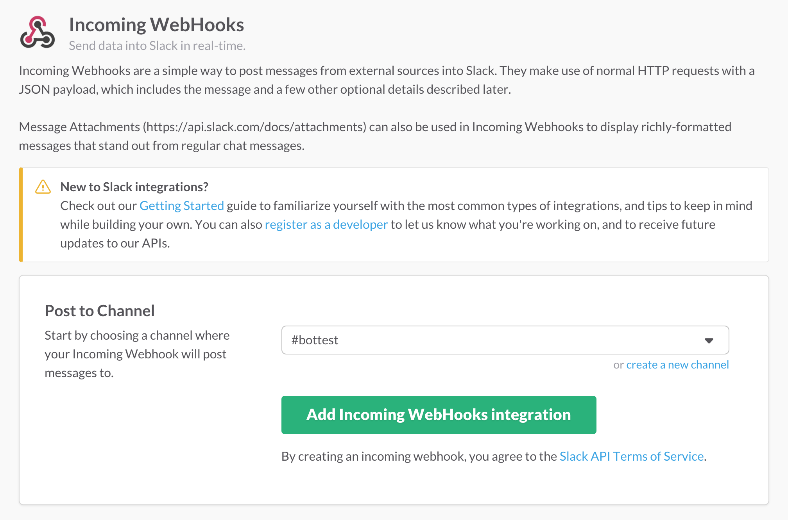

# Incoming Webhooks

一番簡単に外部からメッセージを投稿できる方法。  
HTTPで指定のアドレスにJSONをPOSTする。


## 使い方

1. Integrationを追加する。  
  左のチーム名をクリックすると出てくるメニューから「Apps & Custom Integrations」を選択する。
 

2. IncommingWebhooksを探してクリックする。
 

3. Installボタンをクリックする。
 

4. 投稿対象のChannelを選択して「Add...」ボタンをクリックする。
 

5. Setup Instructionsに記載されているWebhook URLを覚えておく。
 

6. URLにPOSTで"payload"のパラメータに"{"text": "message"}"を送信する。
 

7. 正しく投稿されるとこのようになる。
  


## カスタマイズ

### 名前を変更

 送信JSONにusernameのKeyで文字列を設定すれば名前を変更できる。

### アイコンを変更

 送信JSONにicon_urlのKeyで画像のURLを設定すればアイコンを変更できる。  
{"icon_emoji": ":ghost:"}のような指定方法もある。


### リンクを設定

 {"text": "<https://slack.com>"}のような指定でリンクを挿入する事もできる。


 ```
{
 "text": "<http://fabo.io/|ここ>をクリック",  
 "username": "FaBot",   
 "icon_url": "http://1.bp.blogspot.com/-3Msov6XDWoE/VL476WK4NZI/AAAAAAAAKcc/WPgAiZCIRwY/s320/logo2.png"  
}
 ```
 

### Channelを変更

 {"channel": "#other-channel"}のように指定すると、送信先のChannelを変更することもできる。
